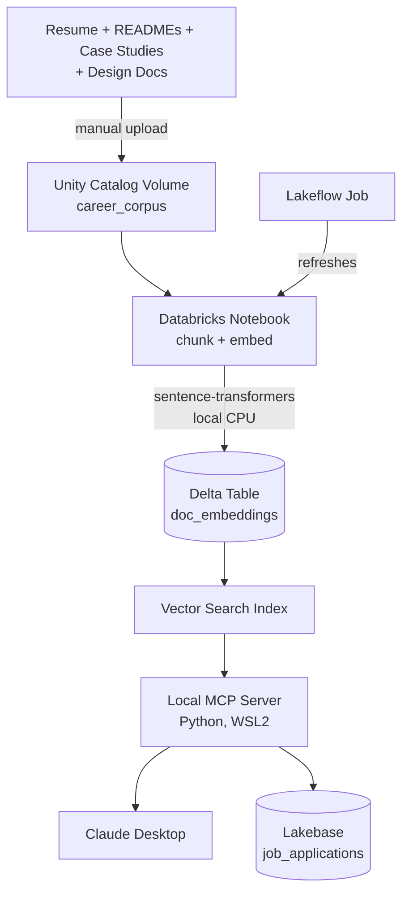

# DE Career Copilot — Agentic RAG + MCP on Databricks

A retrieval-augmented "career copilot" grounded entirely in my own portfolio evidence — resume, project READMEs, case studies, and design-decision docs — exposed as an MCP server so Claude Desktop can query it directly during real interview prep or resume tailoring.

Unlike a generic chatbot, this doesn't just answer questions: it can search my career evidence, fetch a complete case study, check a job description against my documented skills, and log/update real job applications — all as tool calls Claude makes on its own within a single conversation.

**Total cost: $0.** Built entirely on Databricks Free Edition, using local open-source embeddings instead of pay-per-token APIs.

## Architecture



## What is MCP?

The Model Context Protocol is an open standard for connecting AI assistants to external tools and data. This project implements an MCP *server* — a small local program exposing specific capabilities (search, fetch, log) — that an MCP *client* like Claude Desktop can discover and call during a conversation, without any of the underlying infrastructure being hardcoded into the assistant itself.

## Features

- **`search_career_evidence`** — semantic search over my resume, project docs, and case studies via Databricks Vector Search
- **`get_case_study`** — fetches a complete case study, reconstructed in order from its indexed chunks
- **`get_skills_gap`** — deterministic keyword comparison between a pasted JD and my documented evidence, by project
- **`log_job_application`** / **`update_application_status`** — writes to a Lakebase (Postgres-compatible) tracker, demonstrated live chaining multiple tool calls in a single request
- Automated pipeline refresh via a Lakeflow Job — no manual re-running required when new docs are added

## Tech Stack

| Category | Tools |
|---|---|
| Languages | Python (notebooks, MCP server) |
| Lakehouse Platform | Databricks Free Edition — Unity Catalog, Delta Lake, Vector Search, Lakeflow Jobs |
| Embeddings | sentence-transformers (all-MiniLM-L6-v2), run locally — no pay-per-token API |
| Structured Storage | Lakebase (Postgres-compatible) |
| Agent / MCP | Python `mcp` SDK, packaged as a Desktop Extension (.mcpb) |
| MCP Client | Claude Desktop |
| CI | GitHub Actions (pytest, ruff) |

## Quick Start

**1. Databricks setup**
- Create a Free Edition workspace, a Unity Catalog volume for your corpus, and upload your own documents
- Run `databricks/notebooks/01_chunk_documents` to chunk, embed, and index everything
- Create a Vector Search endpoint + index, and a Lakebase project with a `job_applications` table

**2. Local MCP server**
```bash
cd mcp_server
pip install "mcp[cli]>=1.28,<2" databricks-vectorsearch sentence-transformers python-dotenv psycopg2-binary
cp .env.example .env  # fill in your Databricks host/token and Lakebase credentials
```

**3. Package and install as a Desktop Extension**
```bash
npm install -g @anthropic-ai/mcpb
mcpb pack .
```
Install via Claude Desktop → Settings → Extensions → Advanced settings → Extension Developer → Install Extension.

## Project Structure
de-career-copilot/
├── databricks/notebooks/ # chunking, embedding, indexing pipeline
├── mcp_server/
│ ├── server.py # the MCP server itself
│ ├── manifest.json # Desktop Extension metadata
│ └── tests/
├── corpus/project_docs/ # source documents (resume, READMEs, case studies)
└── .github/workflows/ci.yml
## What I'd Change at Scale
See [design_decisions.md](docs/design_decisions.md) for the full ADR, including real trade-offs made under Databricks Free Edition's constraints (serverless-only compute, no pay-per-token API budget, Beta-stage token scoping).

## GitHub
https://github.com/shreya-t-data/de-career-copilot
