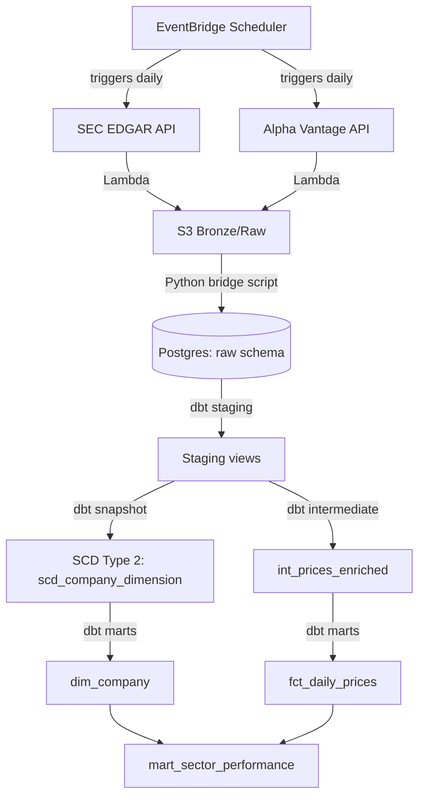

# Financial Data Warehouse on AWS

A cloud-provisioned data pipeline that pulls real SEC filing data and daily stock prices, tracks how company classifications change over time using proper dimensional modeling, and serves analytics-ready tables from a local warehouse — provisioned entirely with Terraform.

## Architecture



## Tech Stack


- **Infrastructure**: Terraform (AWS provider) — S3, Lambda, EventBridge Scheduler, IAM, CloudWatch, Budgets
- **Ingestion**: Python Lambda functions pulling from SEC EDGAR (company fundamentals/SIC classification) and Alpha Vantage (daily OHLCV prices)
- **Warehouse**: Local PostgreSQL via Docker — deliberately not RDS/Redshift, see [design decisions](docs/design_decisions.md)
- **Transformation**: dbt-core — staging → snapshot (SCD Type 2) → intermediate → marts
- **CI/CD**: GitHub Actions — terraform plan, dbt parse, pytest, ruff, all run against real scoped AWS credentials

## Features

- Two serverless ingestion functions, scheduled daily, zero servers to manage
- SCD Type 2 tracking of company industry classification via dbt snapshots — verified with a real before/after change (see below)
- Sector-performance marts joining fundamentals to price performance
- Full CI: infrastructure changes are plan-checked, Python is linted and unit-tested, dbt models are parse-validated — all on every push
- Cost-guarded: S3 lifecycle expiration, CloudWatch log retention, AWS Budget alert, no RDS/Redshift

## The SCD Type 2 Snapshot, In Action

Real SEC reclassifications don't happen on a weekly cadence, so this was verified by manually updating one company's SIC classification in the raw source table and re-running `dbt snapshot`:

| cik | company_name | sic_description | dbt_valid_from | dbt_valid_to |
|---|---|---|---|---|
| 1321655 | Palantir Technologies Inc. | Services-Prepackaged Software | 2026-07-24 18:00:32 | 2026-07-24 18:08:19 |
| 1321655 | Palantir Technologies Inc. | Prepackaged Software | 2026-07-24 18:08:19 | *(current)* |

The old row closed out, a new one opened — exactly the mechanism SCD Type 2 is supposed to provide.

## Quick Start

**1. Provision the AWS infrastructure:**
```bash
cd terraform
cp terraform.tfvars.example terraform.tfvars   # fill in your email + Alpha Vantage key
terraform init
terraform apply
```

**2. Bring up the local warehouse:**
```bash
cp .env.example .env   # fill in real values
docker-compose up -d
```

**3. Run the pipeline:**
```bash
make ingest    # manually trigger both Lambdas
make load      # bridge S3 -> Postgres
make dbt-run   # build and test all dbt models
```

Or all at once: `make demo`

**4. Tear down when done** (guarantees zero ongoing AWS cost):
```bash
make infra-down
```

## Project Structure

├── terraform/ # AWS infrastructure as code
├── src/
│ ├── lambdas/ # SEC EDGAR + Alpha Vantage ingestion functions
│ └── bridge/ # S3 -> Postgres loader
├── dbt/financial_warehouse/
│ ├── models/staging/ # 1:1 with raw sources
│ ├── models/intermediate/ # business logic (returns, rolling metrics)
│ ├── models/marts/ # analytics-ready tables
│ └── snapshots/ # SCD Type 2 company dimension
├── tests/ # pytest unit tests
└── .github/workflows/ # CI: terraform plan, dbt parse, lint, unit tests

## Data Quality

dbt tests enforce: uniqueness and non-null constraints on natural keys, a composite uniqueness test on (ticker, date), and a custom singular test asserting no company ever has two simultaneously "current" rows in the SCD snapshot.

## Cost

Architected to run at effectively $0: no RDS, no Redshift, S3 storage for a few hundred MB costs fractions of a cent, and Lambda's 1M-requests/month tier is permanently free. A $5 AWS Budget alert is provisioned as a backstop. See [design decisions](docs/design_decisions.md) for the full reasoning.

## What I Learned

- Writing a least-privilege IAM policy from scratch means discovering, error by error, every read permission the AWS provider needs to refresh state — a real, iterative process, not something you get right on the first try
- Stooq's CSV endpoint turned out to be gated by a JavaScript bot-verification challenge mid-project — pivoting the entire price-data source to Alpha Vantage was a real production-style "a dependency changed under you" problem, not a planned exercise
- dbt snapshots only make sense once you watch one actually work — reading about `dbt_valid_from`/`dbt_valid_to` is nothing like seeing a row split in two after a real source change

## Future Improvements

- Remote Terraform state (S3 backend + DynamoDB locking) for team-safe applies
- A third Lambda pulling SEC 8-K filings as a lightweight "events" signal
- A second snapshot using the `timestamp` strategy for comparison